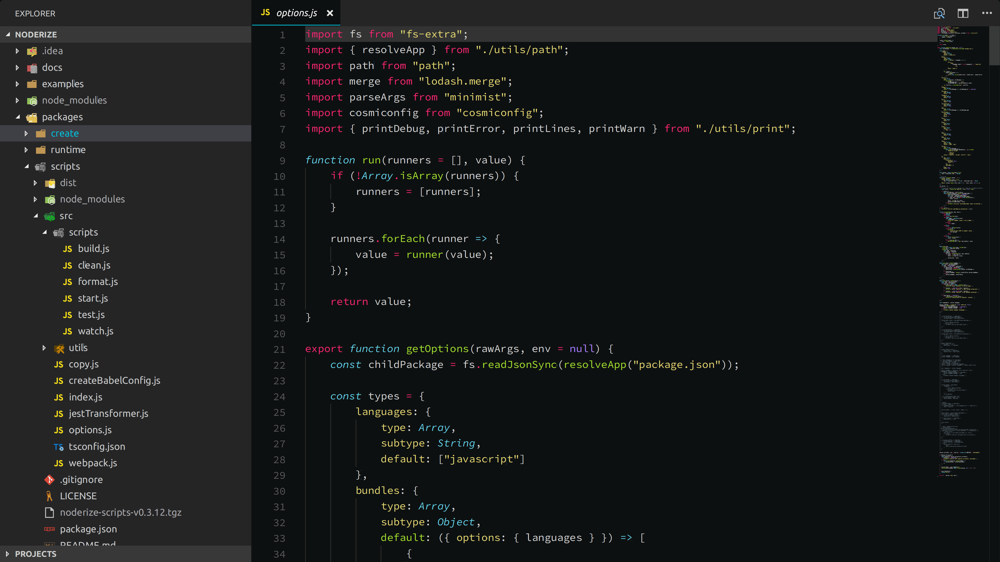
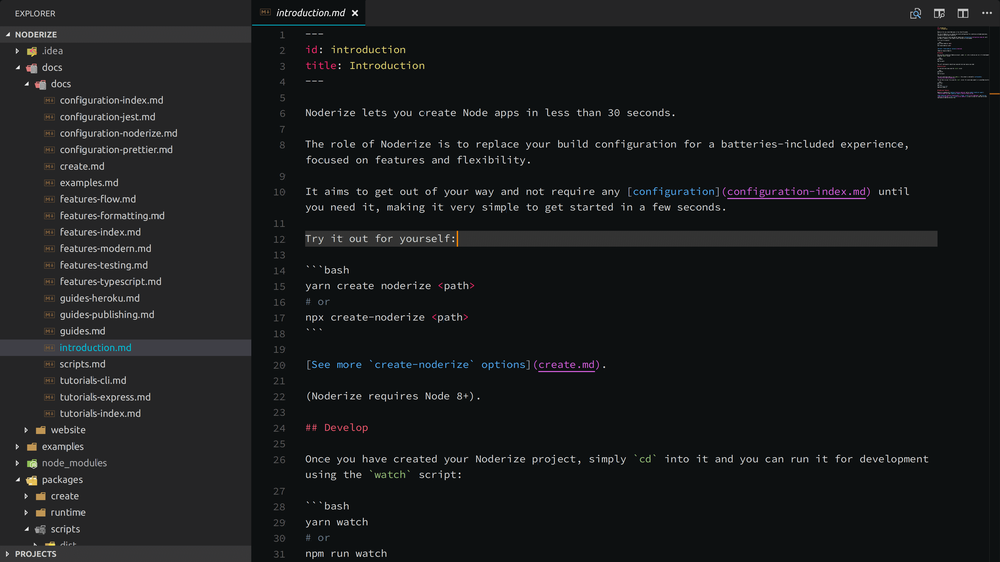
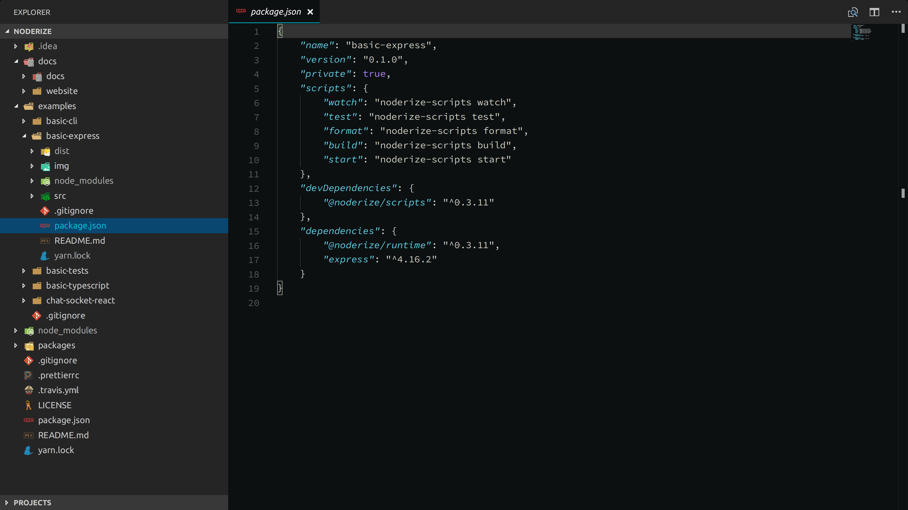

# Monokai Crete

Charles' VSCode Monokai Theme.

This is based off [Seti Monokai](https://github.com/smukkekim/vscode-setimonokai-theme) with Markdown support (from [One Dark Pro](https://github.com/Binaryify/OneDark-Pro)) and few modifications.

## Install

Install by pressing `Ctrl` + `P` then typing/pasting:

`ext install monokai-crete`

To activate, reload then `Ctrl` + `Shift` + `P` and type `Color Theme`, then select Monokai Crete.

## Preview

